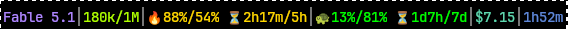

# claude-statusline

One binary that renders [Claude Code](https://claude.com/claude-code)'s status
line. It reads the status-line JSON payload on stdin and prints a single
ANSI-coloured line:


Another session, on a different model — 5h running hot at 88% against an even
burn of 54%, 7d banking it at 13%, and no diff block because nothing has been
edited yet:



Which segment is which:

```
Opus 5 (1M context)│45.7k/200k│🐢22%/48% ⏳2h35m/5h│$3.42│30m45s│+271/-88│● https://github.com/o/r/pull/11573
└─ model ──────────┘└ context ┘└─ 5h window ──────┘└cost┘└ time ┘└ diff ┘└─ pull request ─────────────────┘
```

(the 7d window is dropped from that sketch for width; on a real line it follows
the 5h one.) The pull request is only there when the branch has one.

It is a **faithful port** of the stdlib-Python `status-line.py` it replaces —
same output, byte for byte, for the same stdin. The port exists because a Python
script needs a Python, and a devcontainer that only wants `claude` and `gh` has
no reason to carry one. Nothing about the display changed.

## Install

```bash
pixi global install --channel https://prefix.dev/blooop claude-statusline
```

That puts `claude-statusline` on `PATH` via `~/.pixi/bin`. Then point Claude
Code's `statusLine` at it in `~/.claude/settings.json`:

```json
{
  "statusLine": {
    "type": "command",
    "command": "claude-statusline"
  }
}
```

## How to read the line

* **Model** — one hue per family, on an item-rarity ladder: haiku cyan
  (uncommon), sonnet sky blue (rare), fable violet (epic), opus orange
  (legendary). Anything unrecognised is blue-grey, never grey — grey means
  *absent*, never *unimportant*.
* **Context** — tokens used over window size, on a green→red ramp walked at
  1.6× so it reaches red near 60%, which is where compaction starts to loom
  rather than where the window ends.
* **Rate-limit windows** (`5h`, `7d`) — a pacing gauge, `used%/even%`, where
  `even` is the usage you would have at a perfectly steady burn (i.e. the
  percentage of the window that has elapsed). `20%/87%` is 67 points of
  headroom; 🐢 says you are on pace or banking it, 🔥 says you are ahead of an
  even burn. `⏳42m/5h` is time to reset over window length.

  The colour of the whole block — digits, glyphs and clock together — is the
  **projected finish**: `used/even × 100`, i.e. where the window lands at reset
  if the current rate holds. 100 is break-even and fully green; 200 is twice the
  sustainable rate and fully red. Absolute usage is printed but never hued: an
  even burn projects to 100 at any level, so the number tells you the level and
  the hue tells you the rate.
* **Session** — cost, wall-clock and lines added/removed, so a narrow terminal
  clips them before anything load-bearing.
* **Pull request** — the PR for the branch this session's directory is on. `●`
  open, `○` draft, `◆` merged, `✕` closed: the glyph carries the state and the
  hue only reinforces it, so it still reads on a monochrome terminal or to a
  red-green eye. Absent when the branch has no PR.

  It is printed as a full URL, and it is also an
  [OSC 8](https://gist.github.com/egmontkob/eb114294efbcd5adb1944c9f3cb5feda)
  hyperlink pointing at itself, because the two ways a terminal opens a link do
  not look at the same thing. OSC 8 hands the target to the terminal out of
  band — that is what a ctrl-click follows. Keyboard URL pickers never read it:
  kitty's hints kitten (`ctrl+shift+e`), and the tmux and Vim equivalents, scan
  the visible *text* for something shaped like a URL. A tidy `#11573` gives them
  nothing to match, which leaves the link reachable by mouse only.

  Printing the URL serves both, and that is why this goes last: ~55 columns is
  the widest thing on the line, the end is where the line is already designed to
  give way, and nothing following the URL means nothing for a greedy match to
  swallow.

A window with no data yet reads `⏳5h --` in grey. A window with usage but no
reset clock drops the pacing pair and colours by absolute usage instead, because
there is no second term to compare against. Nothing on stdin, or unparseable
JSON, prints a bare `⏳`.

## Where the PR number comes from

Everything else on the line is in the payload on stdin. A PR number is not, and
`gh pr list` is ~450ms against a warm cache — per render, on every message. So
the lookup is never on the render path:

* **`.git/HEAD` and `.git/config` are read directly**, not via `git rev-parse`.
  Two file reads instead of two fork+execs, and it makes the cache key
  `(repo, branch)` rather than `(directory)` — switch branch and the line
  follows on the next render instead of waiting out a TTL. Worktrees are
  handled: `dl` gives every branch its own checkout, and agents work in
  `git worktree` trees where `.git` is a file and the config lives elsewhere.
* **The answer lives in `~/.cache/claude-statusline/`.** A render reads it and
  prints it. If it is older than 30s the render *also* spawns a detached copy of
  this binary to fetch a new one, for next time, behind a lock so two renders a
  millisecond apart cannot both spawn.
* **A `gh` that fails changes nothing.** No auth, no network, not a GitHub
  remote — the previous answer stays up and the lock's expiry paces the retries.
  Only a successful call may erase a known PR, because losing the link on a blip
  is worse than showing one a minute old.
* **Nothing cached yet shows no segment**, not a spinner or a placeholder. "Not
  asked yet" resolves itself within a second, and until it does it should look
  like what it will probably turn out to be: a branch with no PR.

A merged PR still shows, because the branch outlives the merge and the link
stays worth having. A detached HEAD shows nothing: no branch, no PR, and a raw
sha in the line is only noise.

## Fidelity

The port is held to the original by two test layers:

* **`tests/golden.rs`** — every fixture under `tests/fixtures/` is a recorded
  stdin payload plus the exact stdout the Python script produced for it. The
  expected files are recordings, not hand-written expectations, so a diff is the
  port drifting from the original. Fixtures whose output depends on the clock
  carry a `now` file — the instant the recording was made — replayed through
  `CLAUDE_STATUSLINE_NOW`.
* **`tests/parity.rs`** — runs the real script live and diffs it against the
  binary, for the case a recording cannot catch: the script itself changing.
  Skipped unless you point it at a copy:

  ```bash
  STATUS_LINE_PY=~/.claude/scripts/status-line.py cargo test --test parity
  ```

The PR segment is the one thing on the line the Python script never printed, so
it sits outside that contract by construction: no fixture names a working
directory, so no fixture grows a link, and both layers still hold byte for byte.

Environment variables, all four of them:

| | |
|---|---|
| `CLAUDE_STATUSLINE_NOW` | epoch seconds, for the tests — `resets_at` only means anything relative to "now", so a fixture exercising a mid-window block has to pin the instant it was recorded at |
| `CLAUDE_STATUSLINE_NO_PR` | set to anything to drop the PR segment and the lookup behind it |
| `CLAUDE_STATUSLINE_PR_TTL` | seconds before a cached PR is refreshed (default 30) |
| `CLAUDE_STATUSLINE_CACHE` | where the PR cache lives (default `$XDG_CACHE_HOME`, else `~/.cache`) |

Two behaviours are worth naming because they are inherited rather than designed:
a top-level JSON value that is not an object prints nothing and exits 1 (Python
raises `AttributeError` there), and wrong-typed values *inside* the object are
the one deliberate divergence — Python raises, this treats them as absent, on
the grounds that a status line that renders beats an exception in the prompt.

## Development

```bash
cargo test
cargo clippy --all-targets -- -D warnings
cargo fmt --check
```

## Releasing

The conda package is **not** built here. It is built and published by
[blooop/blooop-feedstock](https://github.com/blooop/blooop-feedstock), which owns
the recipe (`recipes/claude-statusline/recipe.yaml`) and the `prefix.dev`
credentials for the `blooop` channel. This repo only produces the tag the recipe
fetches its source from:

```bash
# bump [package] version in Cargo.toml, commit, then:
git tag v0.1.0 && git push origin v0.1.0
```

Then, in the feedstock, bump `version` and the source `sha256` in the recipe and
run its release workflow:

```bash
gh workflow run release-workflow.yml --repo blooop/blooop-feedstock \
  -f package=claude-statusline -f force_build=true
```

The tag has to exist before the feedstock build, because the recipe fetches the
tag's source tarball by URL and checksum.

## Licence

MIT.
